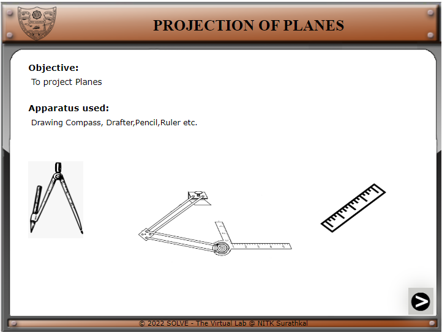
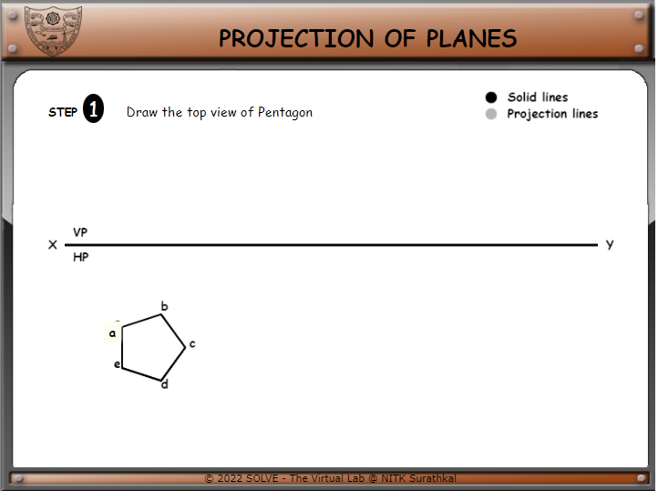
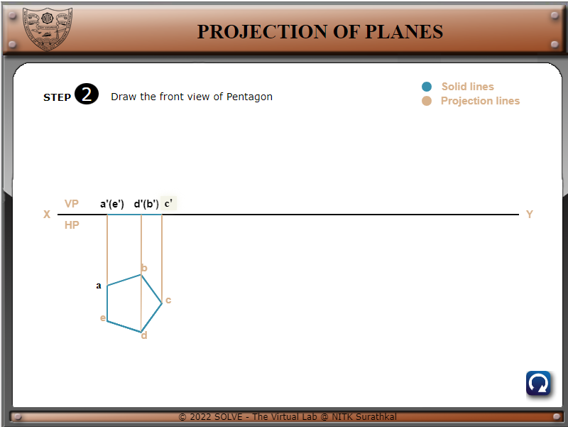
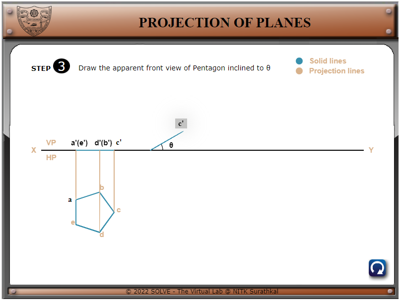
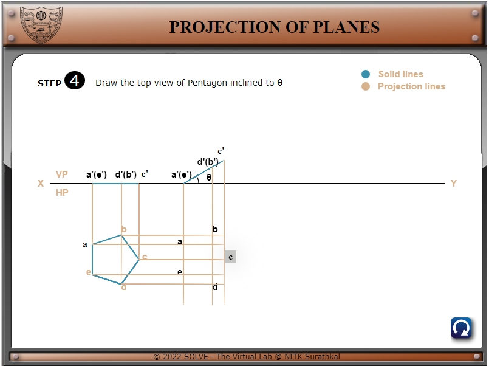
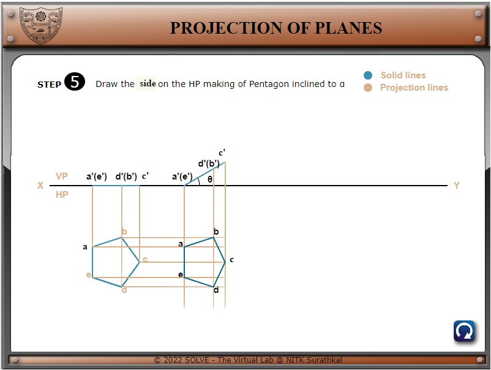
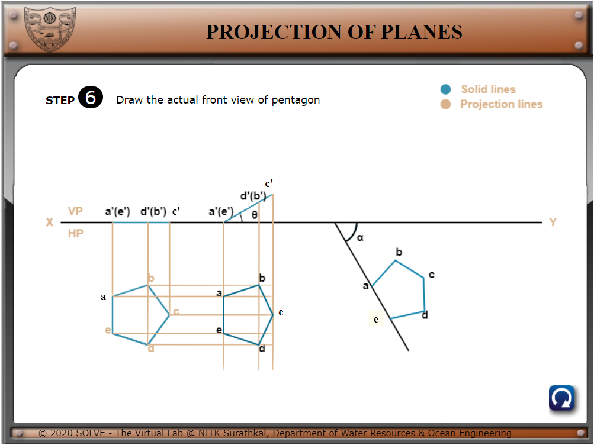
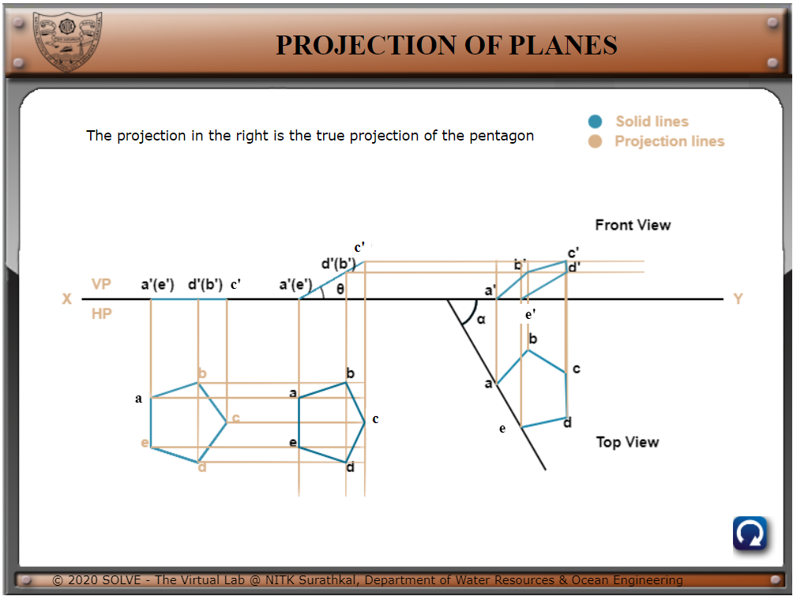

1. Click on **“Simulation”** the following window will open.
    Click on the **NEXT** button to proceed.  

<!--  -->
  

2. Click on **a** for next step of construction. Follow the same  
 (**a\<\<c'\<\<c’\<\<c\<\<side\<\<e\<\<e’**)  

<!--  -->
  

<!--  -->
  

<!--  -->
  

<!--  -->
  

<!--  -->
  

  

<!--  -->

3. Finally, the whole drawing is complete. And to again start with the initial step click on the **Reset** button.    

  

<!--  -->
