### Procedure

1. Click on the Objective icon  to view the objective of the simulation.

   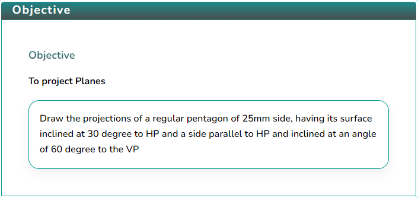

2. Click on the Apparatus icon  to check the tools required for this simulation.

   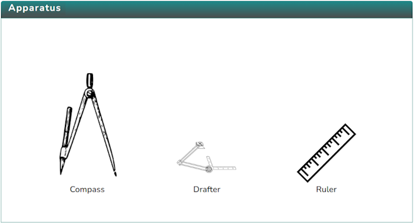

3. Click on the Solution icon  to proceed with further simulation steps.

   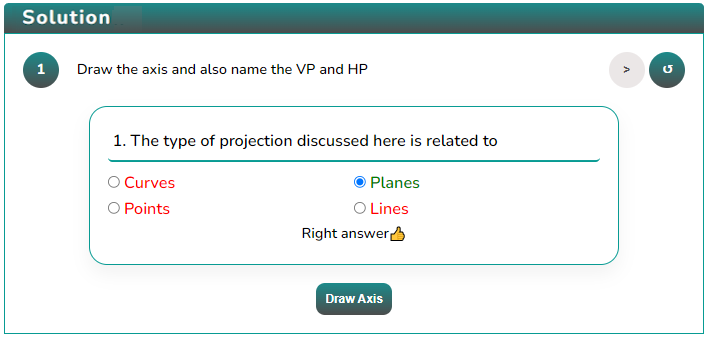

4. Answer the questions that are either based on the data or are from the procedure of the experiment.  
   Answer the question to initiate the simulator, i.e., to draw the axis.

   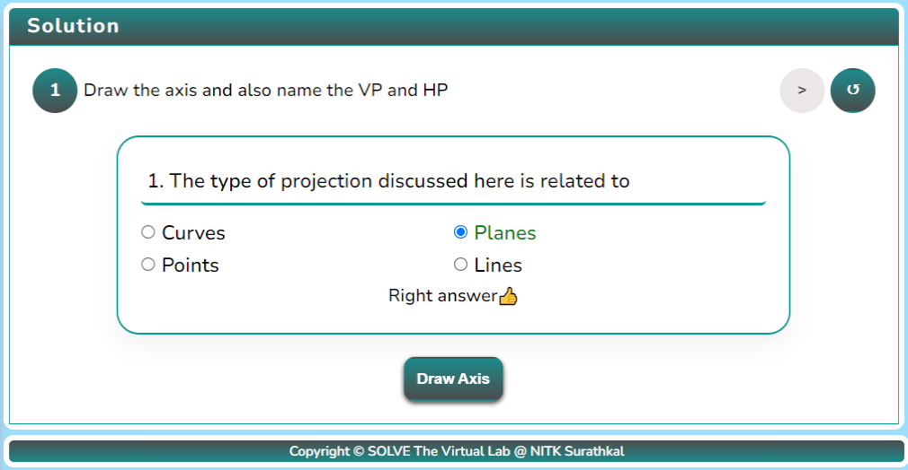

5. After obtaining the XY axis, mark the planes by clicking the button

   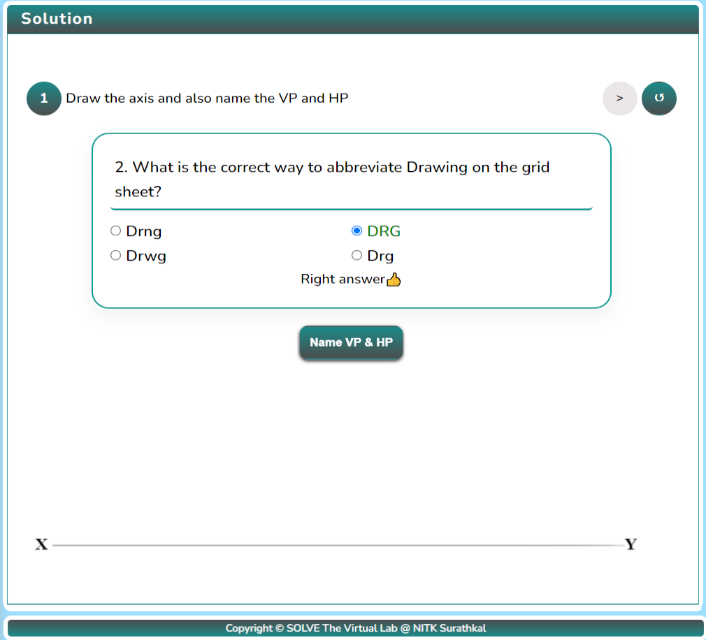

6. After naming the planes, draw the top view of the Pentagon by clicking the button.

   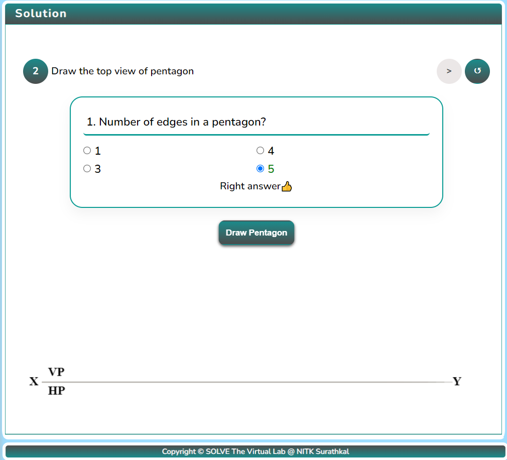

7. After drawing the pentagon, name the vertices by clicking the button.

   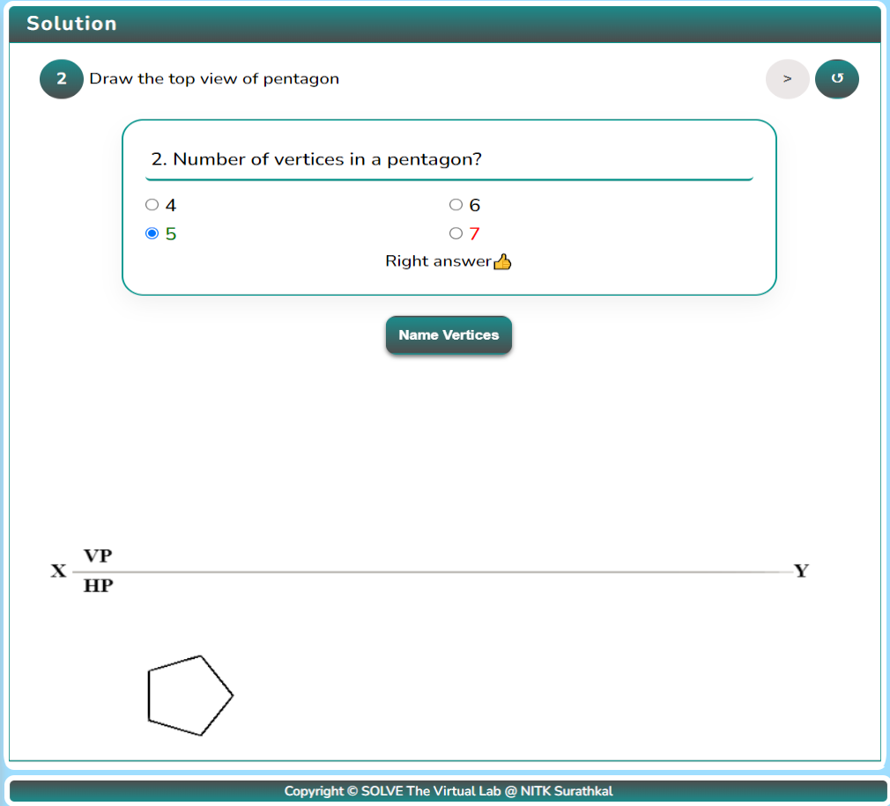

8. After naming the vertices, draw the projection lines by clicking the “Project Line” button.

   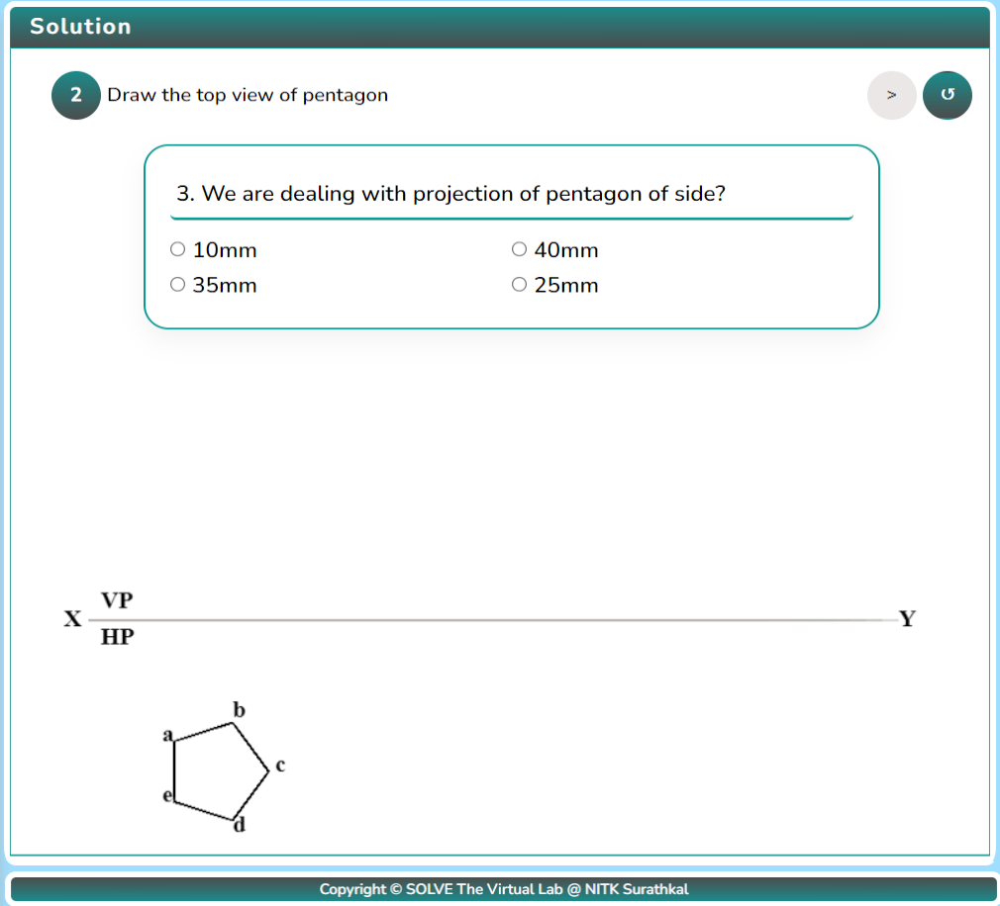

9. After drawing the projection lines, draw the front view by clicking the button.

   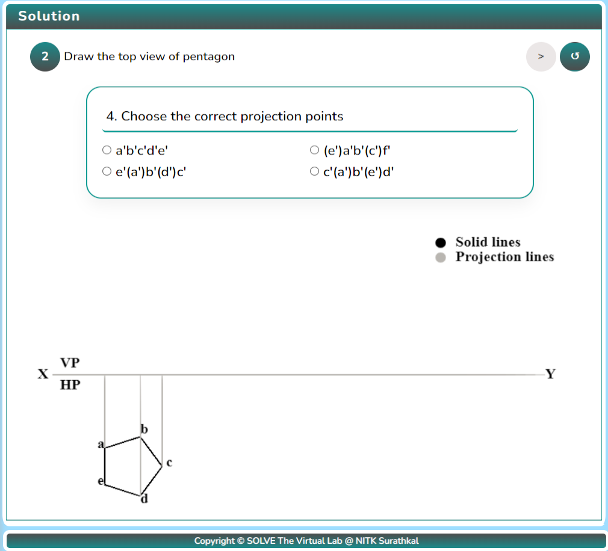

10. After drawing the front view, draw the inclined lines.

    

11. After drawing the inclined line, draw the apparent front view.

    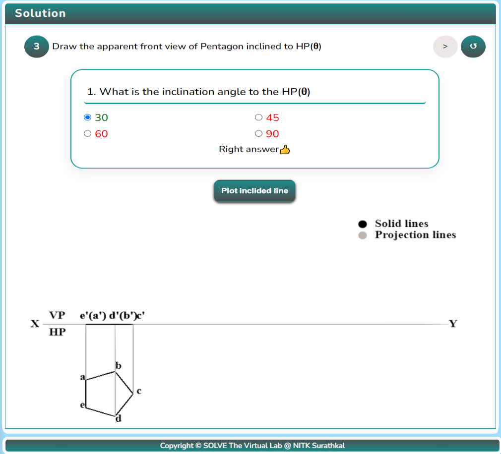

12. Click the “project plane” button for the apparent front view.

    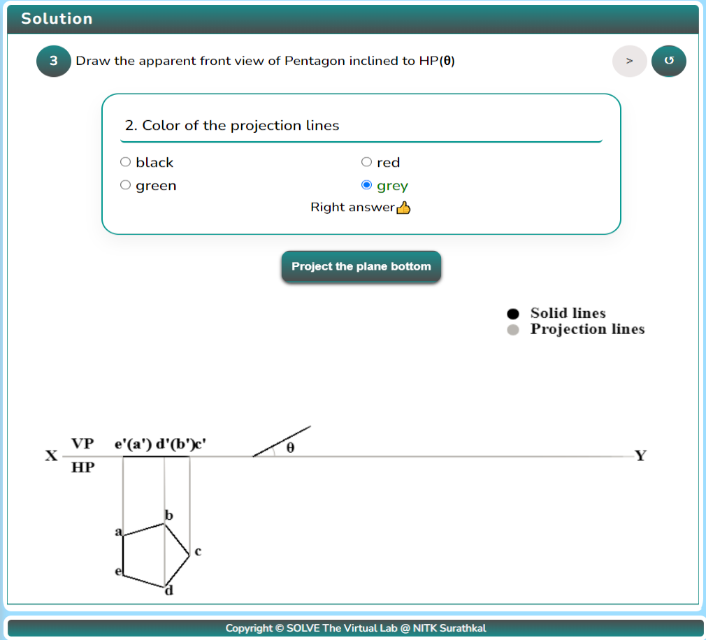

13. Click on the “Next Step Button” to proceed and click on the “Plot Side Button” to plot the side of the pentagon that is inclined to VP.

    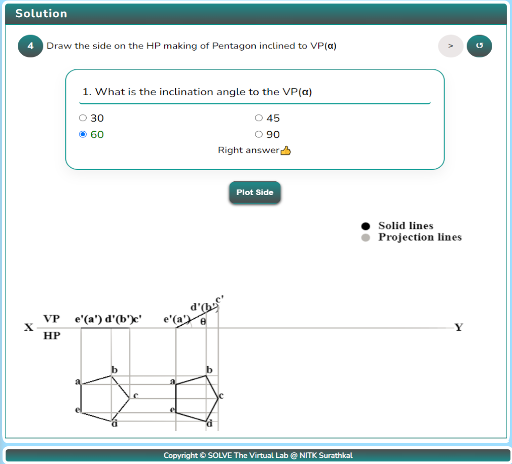

14. After plotting the inclined side, click on the “Next Step” button to proceed and the “Project plane up” button to draw the actual front view of the Pentagon.

    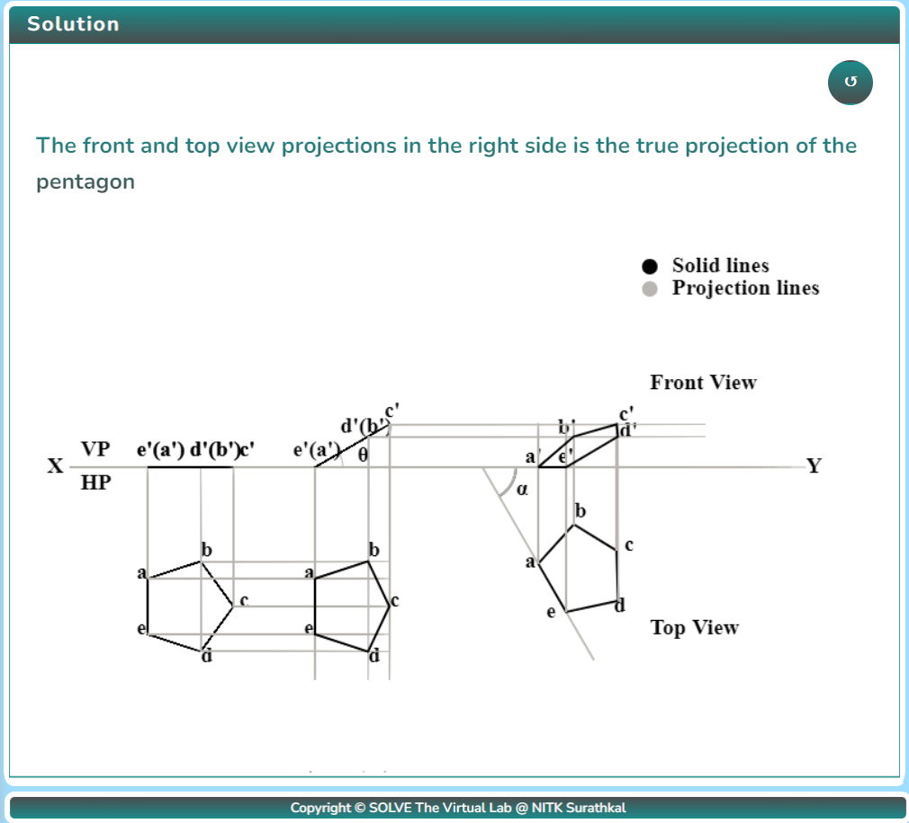

15. After performing the experiment, click on the Reset button  to restart the experiment.
