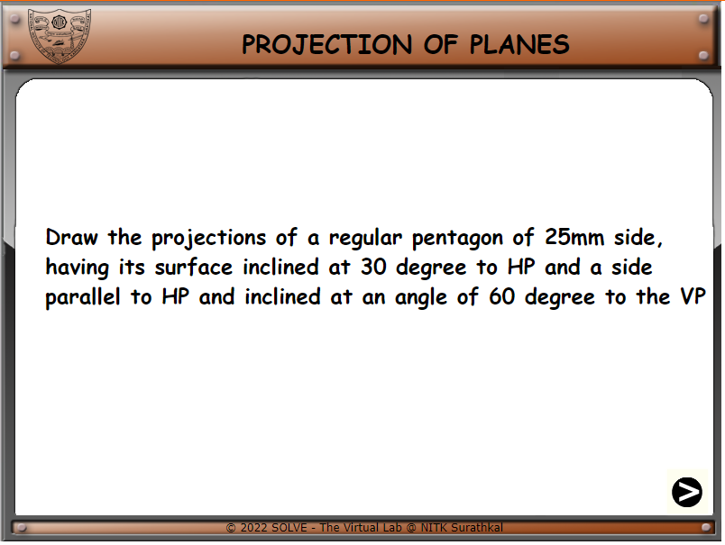
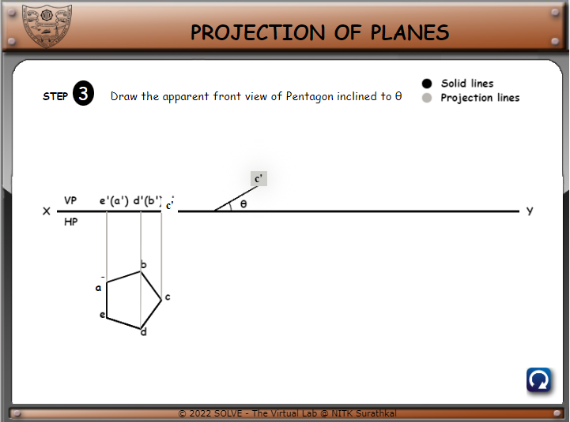
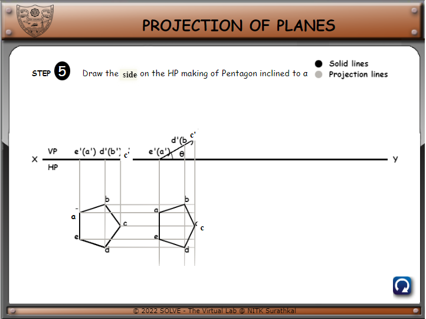
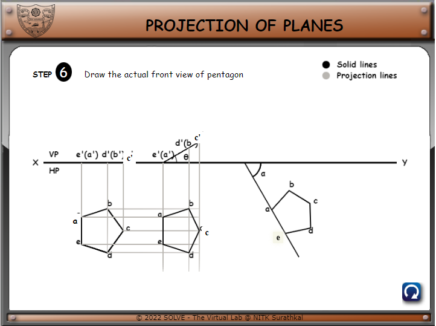
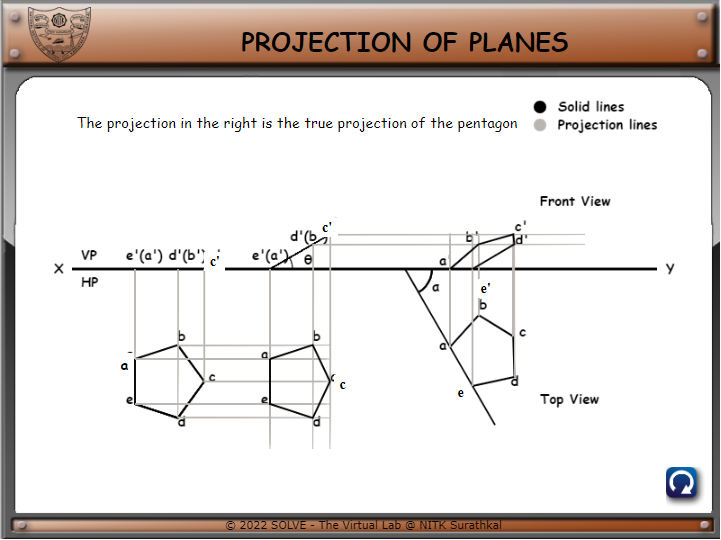

1) Click on **“Simulation”** the following window will open.
    Click on the **NEXT** button to proceed.

2) The question will appear in this slide.

3) Click on **a** for next step of construction. Follow the same  
 (**a\<\<c'\<\<c’\<\<c\<\<side\<\<e\<\<e’**)

4) Finally, the whole drawing is complete. And to again start with the
    initial step click on the **Reset** button.

While drawing on a grid sheet, begin with:
1. Assuming suitable conditions & draw Front View & Top View of initial position. 
2. Now consider surface inclination & draw second Front View & Top View.
3. After this, consider side/edge inclination and draw third ( final) Front View & Top View.

